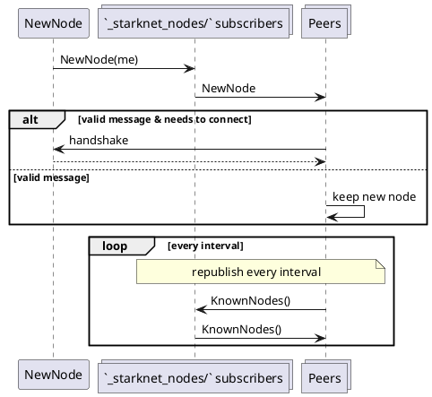
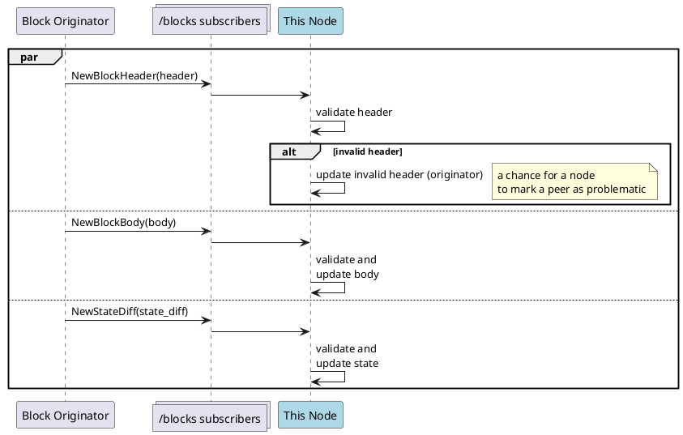
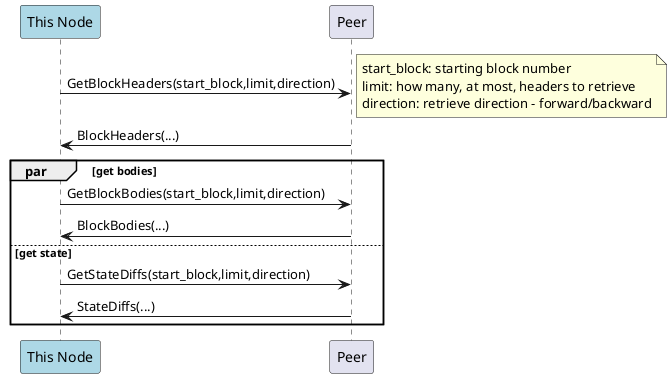

# Starknet P2P Protocol

**Content**

1. [Overview](#overview)
2. [Core Definitions](#core-definitions)
3. [Protocols](#protocols)
    1. [Common Types](#common-types)
    2. [Discovery](#discovery)
    3. [Block Propagation](#block-propagation)
    4. [Synchronization](#synchronization)

----
## Overview

This document aims to provide an overview and necessary details for implementing the P2P protocol for Starknet nodes.

Familiarity with [Starknet](https://starknet.io/) is assumed.

### Document Conventions

Unless otherwise noted, the key words "MUST", "MUST NOT", "REQUIRED", "SHALL", "SHALL", NOT", "SHOULD", "SHOULD NOT", "RECOMMENDED",  "MAY", and "OPTIONAL" in this document are to be interpreted as described in [RFC 2119](https://datatracker.ietf.org/doc/html/rfc2119).

## Core Definitions

As a guiding principle, we leverage [libp2p](https://libp2p.io/) set of [protocols](https://github.com/libp2p/specs) whenever possible. This will let us standardize the protocol. It will also allow node implementations to leverage existing implementations of libp2p, or switch between them if necessary.

As a design choice this results in some loss of generality, but seems like a reasonable given that libp2p is becoming a de-facto standard, and we see little value in re-implementing (and re-inventing) lower level network communication protocols.

Specifically, we identify nodes and address them using [Peer IDs](https://github.com/libp2p/specs/blob/master/peer-ids/peer-ids.md), with key pairs derived using [Ed25519](https://github.com/libp2p/specs/blob/master/peer-ids/peer-ids.md#ed25519) scheme.

Communication will be done over TCP transport.

### Identifying Nodes

An [`Identify` message](https://github.com/libp2p/specs/blob/master/identify/README.md) should include the following fields

`protocolVersion` := `/starknet/` + version

Nodes SHOULD use semantic version matching when matching protocols, as described [here](https://docs.libp2p.io/concepts/protocols/#protocol-negotiation).

`agentVersion` is defined in the form of _agent-name/version_; e.g. `papyrus/0.1.0`.
Agent versions SHOULD follow [semantic versioning](http://semver.org) format.

### Message Encoding

Use protobuf (`proto3`) for message encoding/decoding between peers.
Specific message schemas to be defined for each protocol.

Messages that tie into other messages in one flow, i.e. messages expecting a response and providing a response MUST include a `request_id` (a positive integer) that allows nodes to correlate messages in the same flow.
The request id, together with the sender id, should be enough for identifying the flow.

----


## Protocols

Different flows, namely block propagation, synchronization and transaction propagation, are specified below, on top of lower level network protocols (handshakes, pubsub, etc.). Each section below specifies the flow and the relevant messages passed between different agents.


### Common Types
We begin by describing some common message types used in the different protocols:

```protobuf
message FieldElement
{
    bytes elements = 1;
}

message PeerID
{
    bytes id = 1;
}

message BlockHeader
{
    FieldElement parent_block_hash = 1;
    uint64 block_number = 2;
    FieldElement global_state_root = 3;
    FieldElement sequencer_address = 4;
    uint64 block_timestamp = 5;

    uint32 transaction_count = 6;
    FieldElement transaction_commitment = 7;

    uint32 event_count = 8;
    FieldElement event_commitment = 9;

    uint32 protocol_version = 10;

}

message InvokeTransaction
{
    FieldElement contract_address = 1;
    FieldElement entry_point_selector = 2;
    repeated FieldElement calldata = 3;
    repeated FieldElement signature = 4;
    FieldElement max_fee = 5;
    FieldElement version = 6;
}


message DeclareTransaction
{
    ContractClass contract_class = 1;
    FieldElement sender_address = 2;
    FieldElement max_fee = 3;
    repeated FieldElement signature = 4;
    FieldElement nonce = 5;
    FieldElement version = 6;
}

message ContractClass
{
    message EntryPoint {
        FieldElement selector = 1;
        FieldElement offset = 2;
    }

    repeated EntryPoint constructor_entry_points = 1;
    repeated EntryPoint external_entry_points = 2;
    repeated EntryPoint l1_handler_entry_points = 3;
    repeated string used_builtins = 4;
    FieldElement contract_program_hash = 5;
    repeated FieldElement bytecode = 6;
    string version = 7;
}

message Transaction
{
    oneof txn
    {
        InvokeTransaction invoke = 1;
        DeclareTransaction declare = 2;
    }
}

message Event
{
    ...
}

message BlockBody
{
    uint32 transaction_count = 1;
    repeated Transaction transactions = 2;

    uint32 event_count = 3;
    repeated Event events = 4;
}

```
Peer IDs should be displayed and accepted using content identifier (CID) encoding, described [here](https://github.com/libp2p/specs/blob/master/peer-ids/peer-ids.md#peer-ids).

----

### Discovery

Discovery is the process of joining the network and discovering other relevant peer nodes that are part of the relevant chain.

Simple protocol for discovery, based on pub sub implementation (similar to [pubsub-based discovery](https://github.com/libp2p/js-libp2p-pubsub-peer-discovery/)):





1. A node connects to at least one node of the network
    - Using either [rendezvous protocol](https://github.com/libp2p/specs/tree/master/rendezvous#overview), or bootstrap nodes.
    - Rendezvous point: `_starknet_discover/` + configured chain id.
    - The bootstrap nodes should allow connecting to the pubsub mechanism (either directly, or providing another nodes that does).
    -
2. A node publishes a `NewNode` message to a predefined topic
    - The new node message should be signed and identifiable for the node publishing it (based on PeerID) - a node can only publish a `NewNode` message for itself.
    - Topic: `_starknet_nodes/` + configured chain id.
    - ==Can have subtopics for specific subnets, e.g. discover archive nodes==

3. Subscribers receive the node, and continue to handshake if necessary.
4. A node re-publishes its known nodes (with ids) every predefined interval.


The chain id is the [starknet chain id](https://docs.starknet.io/docs/Blocks/transactions#chain-id) configured for the node.

Note that while technically a node can serve both as a full node and a bootstrap node, this isn't recommended, as bootstrap nodes generally need to be available to serve their discovery role.


<blockquote>
OPEN: how to choose peers to prevent eclipse (and other) attacks
</blockquote>


#### Messages

```protobuf=


message NewNode
{
    PeerID id = 1;

    repeated string capabilities = 2;
}

message KnownNodes
{
    PeerID id = 1; //id of publishing node
    repeated PeerID nodes = 2; //nodes known to the publishing node
}

```

Every node defines a set of capabilities it supports.
Capabilities are represented as strings, with a few capabilities defined as part of the core protocol.
Some capabilities may be parameterized, the exact serialization of the capabilities and their parameters depends on the definition of the capability.

#### Capabilities

Capabilities are advertised by nodes, providing information on services these node execute in the network. This is similar in spirit to [discv5 topics](https://github.com/ethereum/devp2p/blob/master/discv5/discv5-theory.md#topic-table) or the [protocols advertised as part of the libp2p identify protocol](https://github.com/libp2p/specs/tree/master/identify#protocols).
These can be used by nodes in their decision to connect (or remain connected) to other peers.

For the sake of future compatibility and extensions, the Starknet protocol does not enumerate a mandatory list of capabilities. We do define here a scheme for encoding capabilities, and list some core capabilities likely to be used by protocols.

##### String Encoding

Capabilities are denoted by identifiers consisting of simple alphanumeric characters (`a-zA-Z0-9`) and underscore (`_`) and hyphen characters (`-`), in ASCII.

Identifiers can be concatenated using the slashes (`/`), and followed by a version number. This allows for qualifications ("namespaces") and versioning of provided capabilities.

For example: the capability `core/state/1` provided by a node states that it provides the core state querying capability (its 1st version).
The exact semantics of the capability and its version is to be documented as part of the definition of the capability. The capability usually translates into the protocols it supports and/or API it provides to peers.


##### Core Capabilities

We list here core capabilities that SHOULD be exposed by nodes in the network.


| Capbility      | Description |
| -------------- | -------- |
| `core/blocks-sync/1`     | The node provides information about past blocks and corresponding transactions     |
| `core/state-sync/1` | The node provides state snapshot synchronization capability that can help with state synchronization |
| `core/block-propagate/1` | The node participates in block propagation |


<blockquote>
Note: We will later add capability definition for transaction propagation (transaction pools), and potentially other capabilities.
</blockquote>

----
### Block Propagation

The block propagation flow is the flow where nodes propagate information on newly created blocks.

The block originator (the one publishing the block) publishes the necessary information to a well-known topic, with other nodes subsribed to that topic, and receiving the information.
The pubsub implementation will take care of publishing the information to available nodes.




Of course, in this case, invalid body or header will invalidate the block (and the node should mark it as problematic.).

A node SHOULD disregard body and and state diffs for blocks with invalid headers.

The topic used to publish new blocks will be: `blocks/` + configured chain id.
Where the configured chain id is the [starknet chain id](https://docs.starknet.io/docs/Blocks/transactions#chain-id) configured for the node.
Nodes should subscribe to the topic on initialization.

#### Validation

Whenever a new block is received, the block header and body should be validated for consistency.
The validation MUST include:
1. Block number is as expected - consecutive to the parent block.
2. The parent block hash matches the current known tip.
3. Transactions and events in the body must match the commitment in the header.
4. State diff, applied to current state, is consistent with the new state root.

Note that this assumes blocks received are blocks that are agreed by the consensus, or the node has some way to validate that the block received is agreed by the consensus mechanism.


#### Messages

```protobuf
message NewBlockHeader
{
    uint32 request_id = 1;

    BlockHeader header = 2;
}


message NewBlockBody
{
    FieldElement block_hash = 1;
    BlockBody body = 2;
}

message NewBlockState
{
    FieldElement block_hash = 1;
    BlockStateUpdate state_update = 2;
}

message BlockStateUpdate
{
    message StorageDiff {
        FieldElement key = 1;
        FieldElement value = 2;
    }

    message ContractDiff {

        FieldElement contract_address = 1;
        FieldElement nonce = 2;
        repeated StorageDiff storage_diffs = 3;
    }

    message DeployedContract {
        FieldElement contract_address = 1;
        FieldElement contract_class_hash = 2;
    }

    uint32 request_id = 1;

    repeated ContractDiff contract_diffs = 2;
    repeated DeployedContract deployed_contracts = 3;
    repeated FieldElement declared_contract_class_hashes = 4;

}
```

Where contract class hash is defined [here](https://docs.starknet.io/docs/Contracts/contract-hash) and contract address is as defined [here](https://docs.starknet.io/docs/Contracts/contract-address).

----

### Synchronization

A full node is expected to synchronize on the current state of the network.
Full state synchronization includes the block headers and bodies (transaction and events) + the current available state at the highest block in the consensus.


#### Chain Synchronization

Chain synchronization is the process of downloading (and verifying) the necessary block information.
The synchronizing node can choose to connect to several peers and ask to get ranges of data.

<blockquote>
OPEN: Is it possible that a given node does not support sync? i.e. do we need to verify support of synching in the handshake?
</blockquote>




The node asks for a _range_ of block headers and bodies. Relevant responses should be of consecutive headers/bodies starting from the request block number and working in the direction requested.
This should allow nodes to ask several peers for different ranges at the same time, as well work however they wish (from the tip backward, or from some point forward) to fill the necessary state.

In addition, a requesting node can limit responses by size. So responses must be up to the requested size limit.
A peer responding to a message MUST adhere to both limits, i.e. the message MUST NOT violate any of the upper limites.


##### Messages

```protobuf

message GetBlockHeaders
{
    uint32 request_id = 1;

    FieldElement start_block = 2; //block hash of the starting block
    uint64 count = 3; //how many block, at most, to retrieve from this requested starting point
    uint64 size_limit = 4; //limit on size of returned messages.

    bool backward = 5; //TRUE iff the order of headers returned should be in descending order

}

/*
    A response to GetBlockHeaders, returning a consecutive `count` of blocks (or less if there are less available)
 */
message BlockHeaders
{
    uint32 request_id = 1;

    repeated BlockHeader headers = 2;
}

message GetBlockBodies
{
    uint32 request_id = 1;

    FieldElement start_block = 2; //block hash of the starting block
    uint64 count = 3; //how many block, at most, to retrieve from this requested starting point
    uint64 size_limit = 4;

    bool backward = 5; //TRUE iff the order of headers returned should be in descending order

}

message BlockBodies
{
    uint32 request_id = 1;

    repeated BlockBody block_bodies = 2;
}

message GetStateDiffs
{
    uint32 request_id = 1;

    FieldElement start_block = 2; //block hash of the starting block
    uint64 count = 3; //how many block, at most, to retrieve from this requested starting point
    uint64 size_limit = 4;

    bool backward = 5; //TRUE iff the order of headers returned should be in descending order
}

message StateDiffs
{


    message BlockStateUpdateWithHash
    {
        FieldElement block_hash = 1;
        BlockStateUpdate state_update = 2;
    }

    uint32 request_id = 1;
    repeated BlockStateUpdateWithHash block_state_updates = 2;
}
```

<blockquote>OPEN: allow state diffs to be retrieved in parts?</blockquote>


##### Data Validation

Validation of the block bodies is the same as defined for [receiving a new block](#Block-Propagation).


#### State Synchronization

State synchronization allows a node to synchronize the up-to-date state of the network, without having to run the transactions or state diffs one at a time for most of the chain. We assume headers are available, as part of the synchronization protocol. Block bodies are not required for state synchronization.

A node chooses peers to request their latest state snapshot. Peers reply with a subset of the state, and include in the response the block this state is coming from. Part of the response is the block the state is relevant for. Each request is for a _consecutive_ range of storage keys to be retrieved, and the response includes a merkle proof of the retrieved chunk.

The synchronizing node receives different pieces of the state and "stitches" them together. Note that different peers may respond with state from different blocks. The synchronizing node proceeds from the point of the chain it received (per chunk) forward to the tip, by asking for state diffs, like in the chain synchronization case.

The size of returned chunks is deterministic and known in advance as a chain-wide parameter.


```plantuml

participant "This Node" as this #lightblue
participant "Peer" as peer

group sync headers
    note over this, peer
        as described under "Chain Synchronization"
    end note

    this -> peer:
    peer --> this:
end

loop while full state not received
    this -> peer: GetSnapshotStateChunk(chunk_number)
    peer -> this: StateSnapshotChunk(block_num,chunk_number, state_values, proof)
    this -> this: verify proof and apply chunk

    this -> peer: GetClassSnapshotChunk(chunk_number)
    note right: can also get class declarations

    peer -> this: ClassSnapshotChunk(block_num, chunk_number, classes, proof)

    this -> this: apply class declarations

    loop for remaining blocks from `block_number` to tip
        this -> peer: GetStateDiffs(start_block,limit,direction)
        peer -> this: StateDiffs(...)
        this -> this: apply state diffs
    end
    note right
         Apply state diffs up to tip for each chunk
    end note
end

```
The node asks different peers (denoted by `peer` above) for different parts of the snapshot.

Note that we also have seperate requests for the class declarations, which are also part of the state. Although the request/response is similar, this is defined as a separate set of messages since the proof is a bit different (a different height of merkle tree). It also allows a node to optimize this storate of classes separately from the full contract state.

Of course, different chunks (of state and class declarations) can be requested from separate peers.


##### Messages

```protobuf

message GetStateSnapshotChunk
{
    uint32 request_id = 1;

    uint64 chunk_number = 2;
}

message StateSnapshotChunk
{
    uint32 request_id = 1;

    uint64 block_number = 2;
    uint64 chunk_number = 3;

    repeated BlockStateUpdate.StorageDiff storage_diffs = 4; //all the storage diffs in this

    repeated bytes commitment_path = 5; //the merkle path to the committed state root, for each diff

}

message GetClassSnapshotChunk
{
    uint32 request_id = 1;

    uint64 chunk_number = 2;
}

message ClassSnapshotChunk
{
    uint32 request_id = 1;

    uint64 block_number = 2;
    uint64 chunk_number = 3;

    repeated ContractClass classes = 4; //the set of contract classes in the requested chunk

    repeated bytes commitment_path = 5; //the merkle path to the committed state root, for each class definition
}

```

For each diff, the state chunk should provide the merkle path to the state root.
